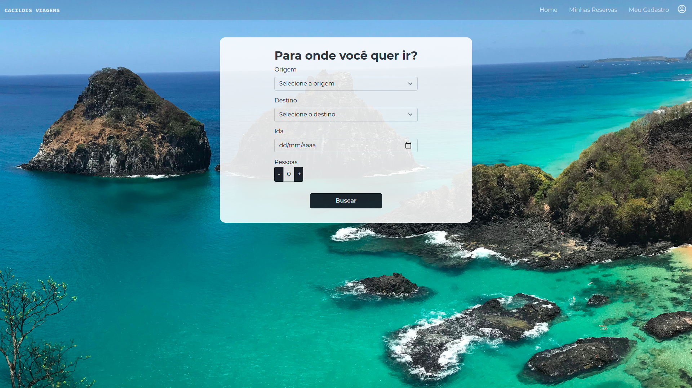

# Cacildis Viagens
>Projeto 2 do bootcamp de Web Dev da Ironhack, desenvolvido em 1 semana;
###

       

###
Aplicação Front-End utilizando React e APIs externas desenvolvida em uma semana.
###

###

## Link para o site
- [Site](https://cacildis-viagens.netlify.app/)

## Link para a apresentação em slides
- [Slides](https://docs.google.com/presentation/d/10gUly10doxrOapuUQIxMY7WLWe4cSDh25B0g7Mf54BM/edit?usp=sharing)

## Desenvolvedores
- Simone Guimarães - simoneguimaraes11@gmail.com

[)](https://github.com/simoneguimaraes) [)](https://www.linkedin.com/in/simone-guimaraes)

- Gustavo Araújo - gustavoaraujofe@gmail.com

 